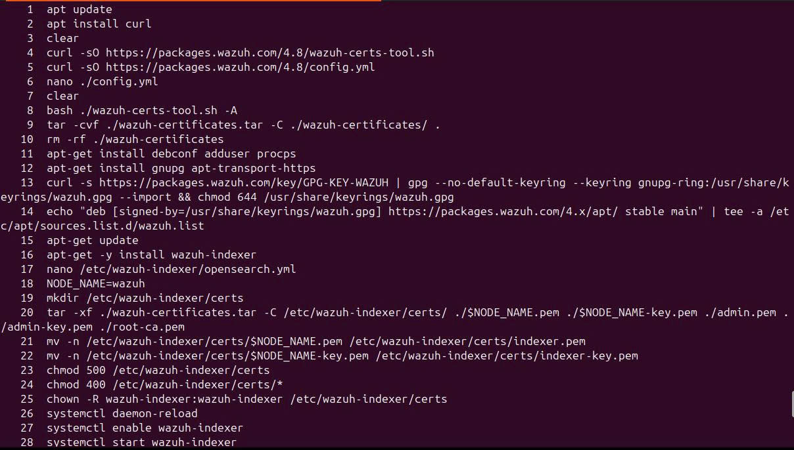

# Triển khai Hệ thống SIEM chuyên nghiệp bằng Wazuh

Dự án này là tài liệu hướng dẫn và mã cấu hình cho việc triển khai hệ thống quản lý sự kiện và thông tin bảo mật (SIEM) mã nguồn mở bằng Wazuh.

## 1. Giới thiệu (Introduction)
Wazuh là một nền tảng bảo mật mã nguồn mở và miễn phí, tập hợp các công cụ EDR (Endpoint Detection and Response) và SIEM (Security Information and Event Management). Hệ thống giúp bảo vệ các môi trường nội bộ, ảo hóa, container và đám mây, cung cấp các tính năng cần thiết để phát hiện các mối đe dọa phổ biến như tấn công từ chối dịch vụ, dò tìm lỗ hổng và tấn công tràn bộ đệm.

## 2. Kiến trúc Hệ thống (Architecture)
Kiến trúc Wazuh dựa trên các agent chạy trên các máy chủ được giám sát để chuyển tiếp log đến một máy chủ trung tâm. Hệ thống bao gồm 4 thành phần cốt lõi:
* **Wazuh Indexer**: Công cụ phân tích và tìm kiếm toàn văn có khả năng mở rộng cao, lập chỉ mục và lưu trữ các cảnh báo dưới định dạng JSON.
* **Wazuh Server**: Giải mã log, phân tích, so sánh sự kiện với bộ quy tắc phát hiện mối đe dọa và quản lý các agent.
* **Wazuh Dashboard**: Giao diện trực quan cho phép theo dõi cảnh báo an ninh, xem thống kê hệ thống và trạng thái các Agent.
* **Wazuh Agent**: Được cài đặt trên các endpoint, thu thập, giám sát sự thay đổi tệp tin (FIM) và gửi dữ liệu đến Wazuh Server.

## 3. Các tính năng nổi bật (Key Features)
* 🔍 **Giám sát toàn vẹn tệp (FIM)**: Theo dõi sự tạo mới, xóa hoặc chỉnh sửa tệp tin theo thời gian thực.
* 🛡️ **Phát hiện lỗ hổng bảo mật (Vulnerability Detection)**: Thu thập danh sách phần mềm điểm cuối và đối chiếu với dữ liệu Cyber Threat Intelligence.
* ⚡ **Phản hồi chủ động (Active Response)**: Tự động chặn kết nối mạng, dừng tiến trình hoặc xóa tệp độc hại khi phát hiện sự cố.
* 📋 **Đánh giá cấu hình bảo mật (SCA)**: Kiểm tra cấu hình hệ thống liên tục dựa trên chuẩn CIS (Center for Internet Security).

## 4. Tích hợp hệ thống mở rộng (Integrations)
Hệ thống hỗ trợ tích hợp mạnh mẽ với các công cụ mã nguồn mở và nền tảng thông minh:
* **VirusTotal**: Kiểm tra mã hash của các tệp đáng ngờ thông qua API.
* **DFIR-IRIS**: Nền tảng điều tra sự cố giúp quản lý và theo dõi cảnh báo tập trung.
* **Suricata (IDS/IPS)**: Phân tích lưu lượng mạng và gửi log cảnh báo tấn công về hệ thống trung tâm.
* **Telegram**: Gửi cảnh báo bảo mật thời gian thực qua Telegram Bot API.
* **ELK Stack**: Mở rộng khả năng lưu trữ và phân tích log với Elasticsearch và Logstash.

---

## 5. Hướng dẫn Triển khai trên Ubuntu

Dưới đây là các lệnh cơ bản để triển khai kiến trúc Cluster và cấu hình Agent.

### 5.1. Cài đặt Wazuh Server & Indexer (Phiên bản 4.7)
Tải file script và file cấu hình trên tất cả các node:

